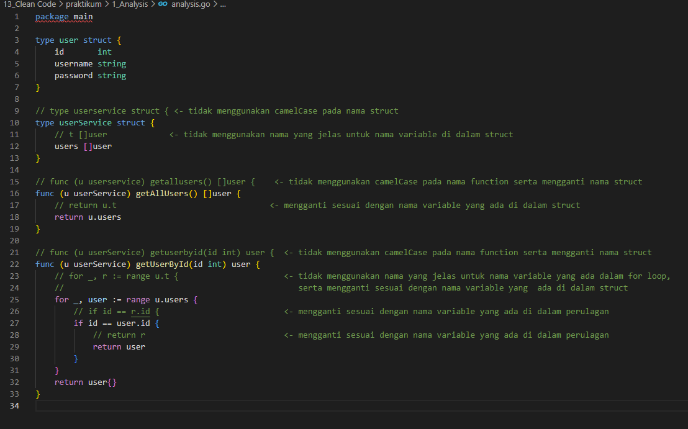
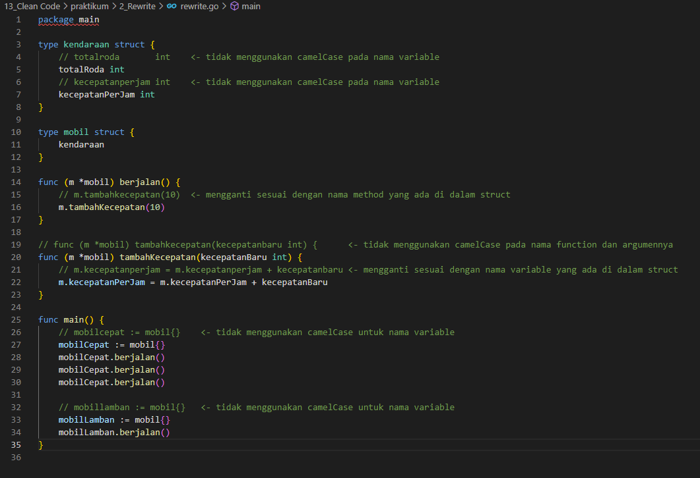

# **Clean Code**
## Oleh: I Dewa Gde Putra Anga Biara

# Resume

* **Clean code** adalah cara untuk membuat sebuah kode program menjadi mudah dimengerti baik ketika dibaca maupun ketika dimodifikasi oleh programmer lain yang mengakses kode tersebut. Artinya, kode program yang baik adalah kode yang mudah dibaca, dimengerti, dan diedit. Selain itu, programmer yang baik juga harus mampu membuat kode yang dapat dimengerti oleh manusia, tidak hanya oleh komputer.

* Clean code sangatlah penting karena dapat mempengaruhi kerjasama tim, pengembangan fitur baru, dan mempercepat proses pengembangan. Beberapa karakteristik dari clean code antara lain mudah dipahami, mudah dieja, penamaan variabel, konstanta, atau fungsi yang jelas dan singkat, konsisten, dan penggunaan komentar yang bijaksana.

* Dalam clean code terdapat dua prinsip yang dapat diterapkan oleh programmer, yaitu **KISS** dan **DRY**. Prinsip KISS berarti *keep it simple, stupid*, yang berarti dalam membuat kode program sebaiknya dibuat dengan cara yang sederhana, singkat, dan jelas. Prinsip DRY berarti *don't repeat yourself*, yang berarti dalam membuat kode program, jika ada proses yang berulang, sebaiknya dijadikan sebuah fungsi dalam sebuah package agar dapat digunakan secara berulang.

 ---

# Latihan

## Praktikum – Clean Code

1. Problem 1 - Analysis
 
   

2. Problem 2 - Rewrite
 
   