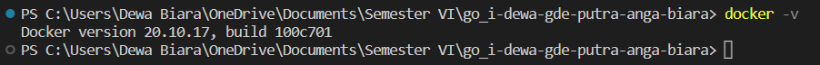
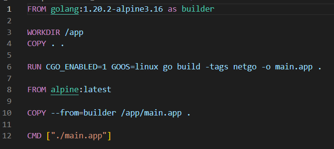
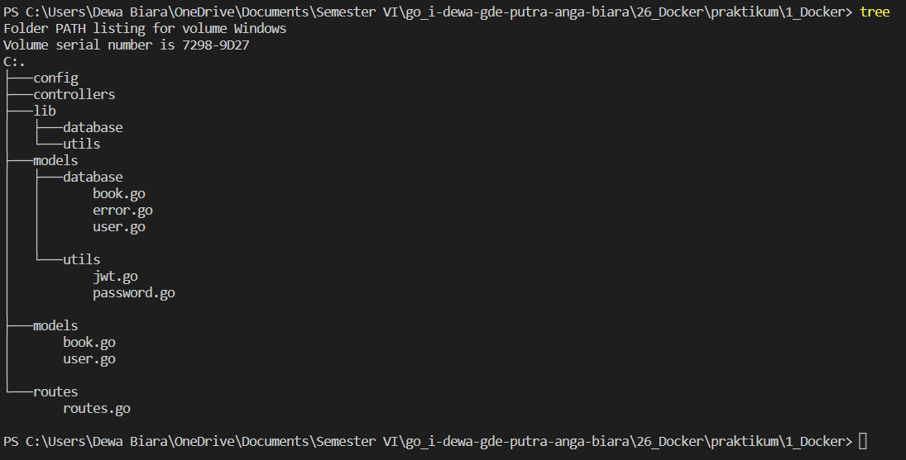
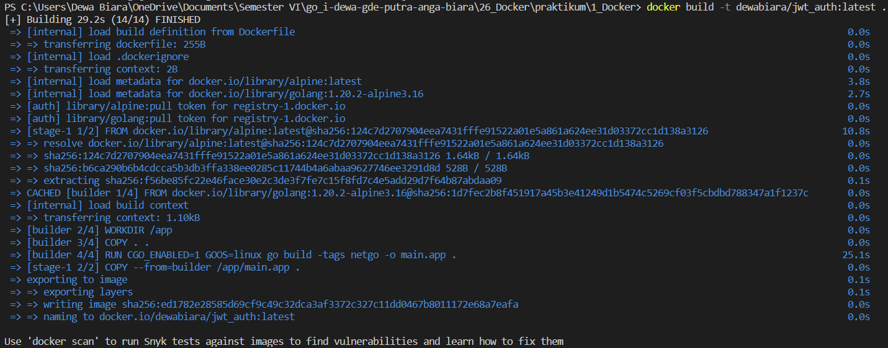
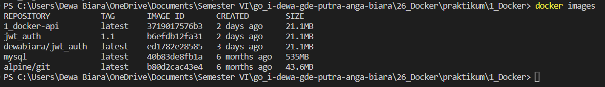
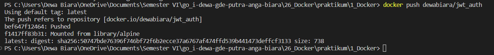
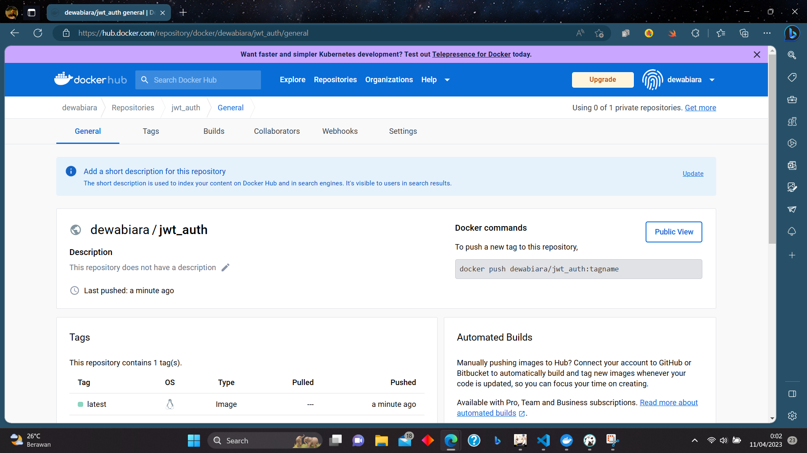
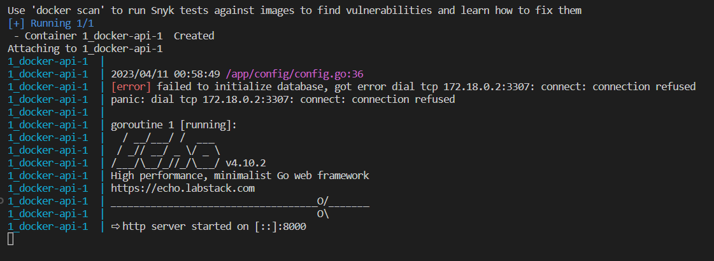
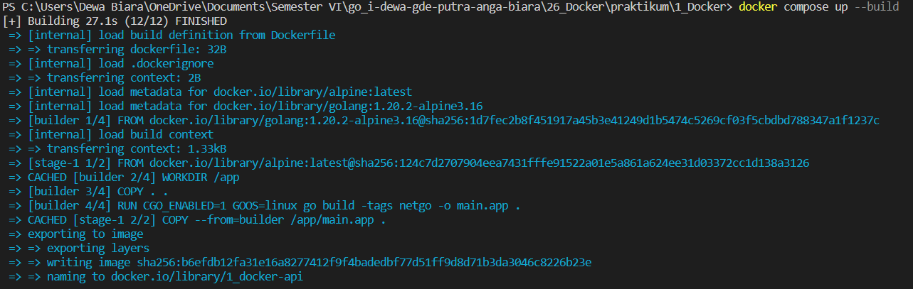

# **Docker**
## Oleh: I Dewa Gde Putra Anga Biara

# Resume

* **Docker** adalah sebuah layanan yang memungkinkan kita untuk mem-packing dan menjalankan sebuah aplikasi dalam sebuah lingkungan terisolasi yang disebut dengan container. Dalam container ini, aplikasi dapat berjalan dengan aman dan terisolasi dari lingkungan sekitarnya, sehingga kita dapat menjalankan banyak container pada sebuah host dengan aman dan stabil. Hal ini disebabkan oleh kemampuan Docker dalam memberikan isolasi dan keamanan yang memadai.

* **Container** adalah teknologi alternatif yang dapat digunakan untuk memvirtualisasi sistem komputer. Dengan menggunakan container, kita dapat mengemas program komputer ke dalam suatu unit standar sehingga semua dependensi dari aplikasi dapat diikutsertakan dalam paket tersebut. Container memungkinkan aplikasi untuk dengan mudah dipindahkan dari satu lingkungan komputasi ke lingkungan komputasi lainnya. Container juga merupakan paket perangkat lunak yang ringan, independen, dan dapat dieksekusi. Paket container mencakup semua yang dibutuhkan untuk menjalankan aplikasi, termasuk kode, runtime, alat sistem, pustaka sistem, dan pengaturan. Selain itu, container juga menawarkan isolasi dan keamanan yang memadai sehingga memungkinkan banyak container dijalankan pada satu host secara bersamaan.

* Docker **image** adalah suatu file yang berfungsi untuk menjalankan kode di dalam sebuah wadah Docker. Image Docker ini berperan sebagai kumpulan instruksi untuk membangun wadah Docker seperti sebuah template. Selain itu, Docker image juga menjadi titik awal dalam menggunakan Docker. Pengertian image Docker dapat diibaratkan seperti snapshot pada lingkungan mesin virtual (VM).

 ---


# Latihan
## Praktikum - ORM and Code Structure (MVC)
## 01 Instalasi Docker
### 
## 02 Dockerfile
### 
## 03 Copy Source Code
Susunan file dan folder dari tugas sebelumnya.
### 
## 04 Build Dokcerfile
### 
Hasil build di docker image.
### 
## 05 Push ke Dockerhub
### 
Hasil push di dockerhub.
### 
## 06 Run Docker Container
### 
## 07 Docker Compose
```yml
version: "3.8"
services:
  api:
    build:
      context: .
      dockerfile: Dockerfile
    ports:
      - "8000:8000"
    networks:
      - mysql_default

networks:
  mysql_default:
    external: true
```
Hasil run docker compose.
### 