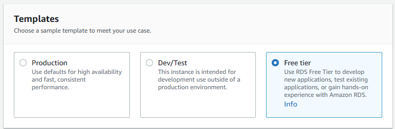
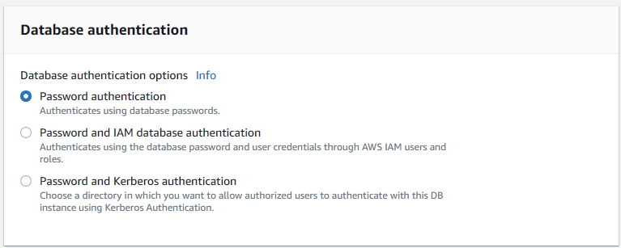

# **Compute Service**
## Oleh: I Dewa Gde Putra Anga Biara

# Resume

* **Docker** adalah sebuah layanan yang memungkinkan kita untuk mem-packing dan menjalankan sebuah aplikasi dalam sebuah lingkungan terisolasi yang disebut dengan container. Dalam container ini, aplikasi dapat berjalan dengan aman dan terisolasi dari lingkungan sekitarnya, sehingga kita dapat menjalankan banyak container pada sebuah host dengan aman dan stabil. Hal ini disebabkan oleh kemampuan Docker dalam memberikan isolasi dan keamanan yang memadai.

* **Container** adalah teknologi alternatif yang dapat digunakan untuk memvirtualisasi sistem komputer. Dengan menggunakan container, kita dapat mengemas program komputer ke dalam suatu unit standar sehingga semua dependensi dari aplikasi dapat diikutsertakan dalam paket tersebut. Container memungkinkan aplikasi untuk dengan mudah dipindahkan dari satu lingkungan komputasi ke lingkungan komputasi lainnya. Container juga merupakan paket perangkat lunak yang ringan, independen, dan dapat dieksekusi. Paket container mencakup semua yang dibutuhkan untuk menjalankan aplikasi, termasuk kode, runtime, alat sistem, pustaka sistem, dan pengaturan. Selain itu, container juga menawarkan isolasi dan keamanan yang memadai sehingga memungkinkan banyak container dijalankan pada satu host secara bersamaan.

* Docker **image** adalah suatu file yang berfungsi untuk menjalankan kode di dalam sebuah wadah Docker. Image Docker ini berperan sebagai kumpulan instruksi untuk membangun wadah Docker seperti sebuah template. Selain itu, Docker image juga menjadi titik awal dalam menggunakan Docker. Pengertian image Docker dapat diibaratkan seperti snapshot pada lingkungan mesin virtual (VM).

 ---

# Latihan

## Praktikum - Compute Service

---

### Tugas 1

1.  Membuat VM di EC2 dan Implementasi _Security Group_

    1.  Beri nama _instance_
    
        

    2.  Pilih _AMI_ yang akan digunakan (OS)

        

    3.  Pilih _Instance Type_

        

    4.  Buat Key Pair untuk Login

        

    5.  Buat _Security Group_ untuk _instance_

        

    6.  Atur _Storage_ untuk _instance_

          

    7.  Buat _instance_

        

    8.  _Instance_ berhasil dibuat

        

2.  SSH _remote instance_

    _Remote instance_ melalui SSH ke DNS _Public Instance_ dan menggunakan _key pair_ yang telah dibuat tanpa memerlukan _password_ kembali. 

    

3.  _Deploy program_ ke EC2

    Karena tidak ada repository khusus untuk project kode, maka saya menggunakan aplikasi yang sudah tercontainerize dan sudah ada di _Docker Hub_.

    -   `docker-compose.yml`

        ```yml
        version: "3.8"
        services:
        api:
            image: "dewabiara/learn_docker:latest"
            build:
            context: .
            dockerfile: Dockerfile
            ports:
            - "80:80"
            environment:
            - DB_USER=root
            - DB_PASS=root
            - DB_HOST=db
            - DB_PORT=3306
            - DB_NAME=layered_api
            - PORT=:80
            - JWT_SECRET=secret
            depends_on:
            db:
                condition: service_healthy
        
        db:
            image: "mysql:latest"
            environment:
            - MYSQL_ROOT_PASSWORD=root
            - MYSQL_DATABASE=layered_api
            healthcheck:
            test: ["CMD", "mysqladmin" ,"ping", "-h", "localhost"]
            timeout: 20s
            retries: 10
        ```

    -   Test akses

        


---

### Tugas 2

1.  Membuat DB dengan service RDS

    1.  Pilih _Engine_ dan _Version_

        
    
    2.  Pilih _Templates_ yang akan digunakan (pada kasus ini memilih _free tier_)
        
        

    3.  Beri nama _DB_ dan _Credentials_

        

    4.  Atur _Instace Configuration_

        

    5.  Atur _Storage_

        

    6.  Pilih _VPC_, _Subnet_ dan _Security Group_

        

    7.  Atur _Database Authentication method_

        

2.  _Migrate local data_ ke Amazon RDS

    1.  Dump data dari _local database_ ke file `.sql`

        
        

    2.  Import data dari file `.sql` ke _RDS_

        

    3.  Cek hasil import 

        

3.  _Connect app_ dengan DB RDS

    1.  Ubah _environment variable_ pada `docker-compose.yml`

        ```yml
        version: "3.8"
        services:
        api:
            image: "dewabiara/rest_api:latest"
            build:
            context: .
            dockerfile: Dockerfile
            ports:
            - "80:80"
            environment:
            - DB_USER=admin
            - DB_PASS=***********
            - DB_HOST=db-1.cjpwqbu9u4ck.ap-southeast-1.rds.amazonaws.com
            - DB_PORT=3306
            - DB_NAME=layered_api
            - PORT=:80
            - JWT_SECRET=secret
        ```

    2.  _Deploy_ ulang aplikasi

        

    3.  Cek hasil _deploy_

        
